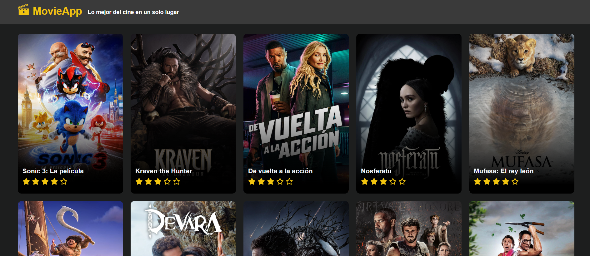

# Movie App

Aplicación desarrollada en **React** que muestra un listado de las últimas películas del año. Utiliza la API de [The Movie Database (TMDB)](https://developer.themoviedb.org/docs/getting-started).

---

## Tecnologías utilizadas

- **React**
- **ReactIcons**
- **ReactLoading**
- **ReactRouter**
- **Vite**
- **TypeScript**
- **SASS**
- **ESLint**

---   

## Aplicación

Puedes acceder a la aplicación desplegada aquí: [Movie App](https://movie-app-fhr.vercel.app/)

---

## Autor

Desarrollado por: Fernando Hidalgo Rosabal.

---

## Licencia

Este proyecto está licenciado bajo la [Licencia MIT](https://opensource.org/licenses/MIT).

---
